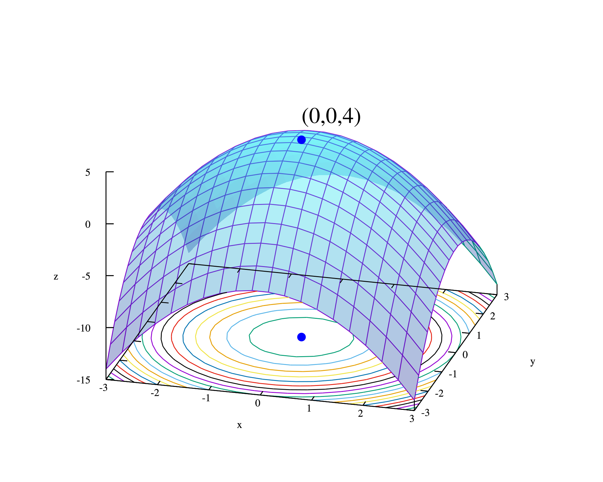

# Continuous Optimization

## Description

The goal of this course is to provide an analytical and computational approach to continuous optimization problems. 
Nonlinear optimization problems arise in a wide variety of applications ranging from machine learning and portfolio selection to signal processing.
Course topics include constrained optimization, linear and conic optimization, duality theory, convex and self-concordant functions. 
Optimization algorithms such as gradient and stochastic gradient methods, Newton's method, and interior-point methods are covered as well.
A dedicated lecture treats the training of **neural networks** and the **automatic differentiation** that powers modern machine learning.

## Prerequisites

Following Boyd & Vandenberghe (*Convex Optimization*), the course assumes a good knowledge of linear algebra (vectors and matrices, eigenvalues, symmetric and positive (semi)definite matrices, inner products and norms) and of multivariable/advanced calculus (gradients, Hessians, the chain rule, Taylor's theorem). Some exposure to real analysis (sequences, continuity, compact sets) and mathematical maturity in reading and writing proofs are helpful but not strictly required. No prior knowledge of optimization is assumed.

## Team

**Bart Van Parys**

- Office: M330
- Address : Centrum Wiskunde & Informatica (CWI), Science Park 123, 1098 XG Amsterdam, the Netherlands 
- Email: [mastermath@vanparys.xyz](mailto:mastermath@vanparys.xyz)

## Agenda

**Lectures:** Monday, 10.00am-12.45pm at Utrecht (room TBD)

**Credits:** 6 EC

## Grading

1. (20%) Problem Sets 
   
   | Problem Set                                                              | 
   |:-------------------------------------------------------------------------|
   | 1. Convex sets and functions. Generalized inequalities and convex cones. | 
   | 2. Nonlinear optimization; applications and modeling.                    |
   | 3. Nonlinear duality, conjugate functions.                               |
   | 4. Gradient methods and interior point methods.                          |

   All problem sets are graded and returned with feedback; at most one hand-in every two weeks.

2. (80%) Written final examination (open book). The material covered is announced two weeks in advance.

A student passes only if the score on the (final or retake) examination is at least 5.0; the final grade is then the weighted average above. The retake is a written open-book examination covering the whole course, and the homework grade is retained and still counts towards the final grade after the retake.

## Outline

| Lecture                                                                                                                                  | Date               |
|:-----------------------------------------------------------------------------------------------------------------------------------------|:-------------------|
| 1. [Introduction to Continuous Optimization](https://bpgvp.github.io/mm-continuous-optimization/L1-Introduction.pdf)  | Mon 7 Sep (wk 37)  |
| 2. [Convexity](https://bpgvp.github.io/mm-continuous-optimization/L2-Convex-Sets.pdf)                                         | Mon 14 Sep (wk 38) |
| 3. [Separation Theorems & Farkas' Lemma](https://bpgvp.github.io/mm-continuous-optimization/L3-Separation.pdf)                | Mon 21 Sep (wk 39) |
| 4. [Lagrangian Duality](https://bpgvp.github.io/mm-continuous-optimization/L4-Lagrangian-duality.pdf)                         | Mon 28 Sep (wk 40) |
| 5. [Gradient Descent & Subgradients](https://bpgvp.github.io/mm-continuous-optimization/L5-Subgradients.pdf)                  | Mon 5 Oct (wk 41)  |
| 6. [KKT Optimality Conditions](https://bpgvp.github.io/mm-continuous-optimization/L6-KKT.pdf)                                 | Mon 12 Oct (wk 42) |
| 7. [Black-Box Optimization Methods](https://bpgvp.github.io/mm-continuous-optimization/L7-Black-Box.pdf)                      | Mon 19 Oct (wk 43) |
| 8. [Gradient Methods](https://bpgvp.github.io/mm-continuous-optimization/L8-Gradient-method.pdf)                              | Mon 26 Oct (wk 44) |
| 9. [Newton's Method](https://bpgvp.github.io/mm-continuous-optimization/L9-Newtons-Method.pdf)                                | Mon 2 Nov (wk 45)  |
| 10. [Self-Concordant Functions](https://bpgvp.github.io/mm-continuous-optimization/L10-Self-Concordant-Functions.pdf)         | Mon 9 Nov (wk 46)  |
| 11. [Interior-Point Methods](https://bpgvp.github.io/mm-continuous-optimization/L11-Interior-Point-Methods.pdf)               | Mon 16 Nov (wk 47) |
| 12. [Stochastic Gradient Descent](https://bpgvp.github.io/mm-continuous-optimization/L12-Stochastic-Gradient-Descent.pdf)     | Mon 23 Nov (wk 48) |
| 13. [Neural Networks & Automatic Differentiation](https://bpgvp.github.io/mm-continuous-optimization/L13-Neural-Networks.pdf) | Mon 30 Nov (wk 49) |
| 14. [Performance Estimation Programming](https://bpgvp.github.io/mm-continuous-optimization/L14-Performance-Estimation.pdf)   | Mon 7 Dec (wk 50)  |
| 15. [Variable Metric & Quasi-Newton Methods](https://bpgvp.github.io/mm-continuous-optimization/L15-Variable-Metric.pdf)      | Mon 14 Dec (wk 51) |

	
## Reference Books

* [Convex Optimization](https://web.stanford.edu/~boyd/cvxbook/bv_cvxbook.pdf) by Stephen Boyd and Lieven Vandenberghe, Cambridge University Press, 2004.
* [Introductory Lectures on Convex Optimization](http://link.springer.com/10.1007/978-1-4419-8853-9) by Y. Nesterov, Springer, 2004.

## Policy on Individual Work

In the case of written homework assignments, your assignment must represent your own individual work. Although you may discuss homework problems with other students, assignments must represent your own work.

